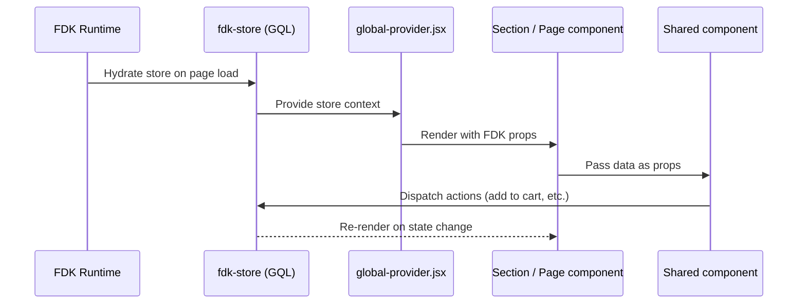
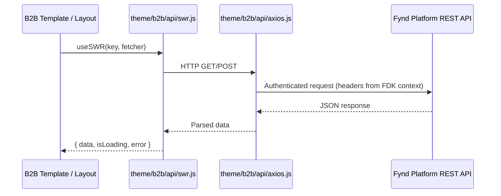
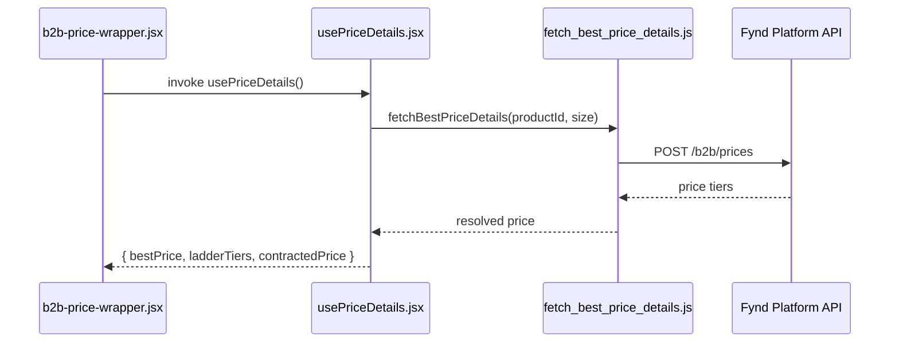
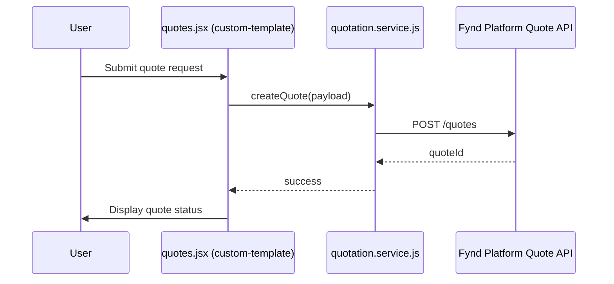

# Data Flow

Owner: Frontend Platform Team
Reviewers: Theme Team, QA
Last Updated: 2026-03-14
Last Reviewed: 2026-03-14
Status: Approved

## Standard FDK data flow

## B2B REST data flow (SWR)

## B2B pricing data flow

Best-price and ladder-price resolution is handled by two helpers:

- `theme/helper/b2b/fetch_best_price_details.js` — fetches best available price for a single product
- `theme/helper/b2b/fetch_best_price_list.js` — batch price fetch for product lists
- `theme/b2b-page-layouts/pdp/price-details/usePriceDetails.jsx` — React hook wrapping price fetch for PDP

## Quote flow

