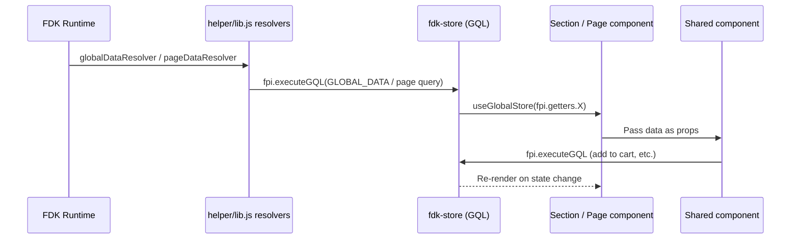
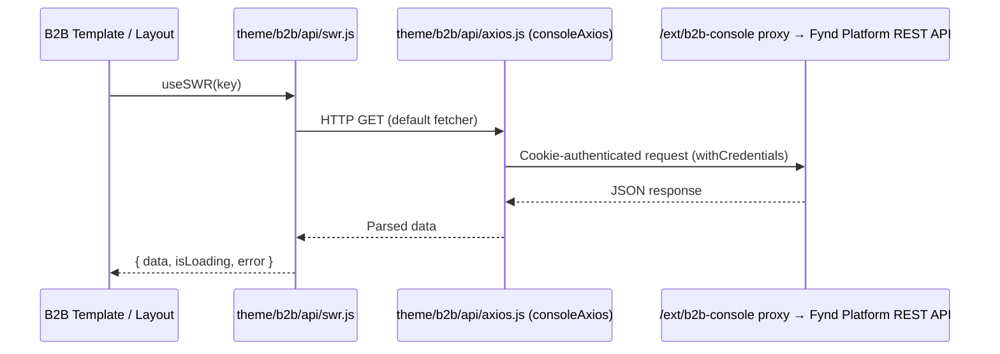
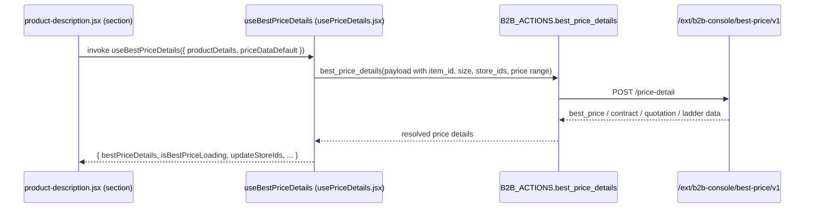
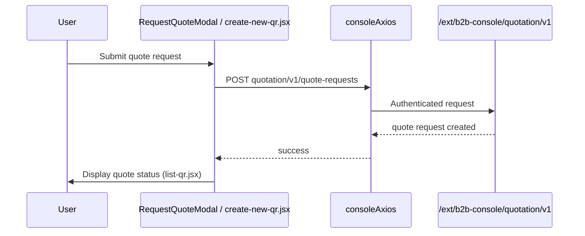

# Data Flow

Owner: Frontend Platform Team
Reviewers: Theme Team, QA
Last Updated: 2026-06-11
Last Reviewed: 2026-06-11
Status: Approved

## Standard FDK data flow

GraphQL documents live in `theme/queries/` (one file per domain: `cartQuery.js`, `pdpQuery.js`, `plpQuery.js`, …). On boot, `globalDataResolver` / `pageDataResolver` (`theme/helper/lib.js`) execute the global/page queries; components read state with `useGlobalStore(fpi.getters.X)` and trigger mutations/queries with `fpi.executeGQL(...)`.

## B2B REST data flow (SWR)

`theme/b2b/api/swr.js` exports `SWRProvider`, which wraps the SWR-driven custom-template routes (mainly the distributed-dashboard routes in `theme/custom-templates/index.jsx`) and sets `consoleAxios.get` as the default fetcher. `consoleAxios` (`theme/b2b/api/axios.js`) targets `<origin>/ext/b2b-console` with `withCredentials: true`; extra `x-application-data` / `x-user-data` headers and cookie forwarding only apply in local-dev mode.

## B2B pricing data flow

Best-price resolution (best price, contract, quotation, ladder, pricing tier) is handled by helpers in `theme/helper/b2b/`, exposed through the `B2B_ACTIONS` map (`theme/helper/b2b/index.js`):

- `theme/helper/b2b/fetch_best_price_details.js` — fetches best available price for a single product (`POST /best-price/v1/price-detail`)
- `theme/helper/b2b/fetch_best_price_list.js` — batch price fetch for product lists (`POST /best-price/v1/price-list`)
- `theme/b2b-page-layouts/pdp/price-details/usePriceDetails.jsx` — exports the `useBestPriceDetails` hook, consumed by the PDP section (`theme/sections/product-description.jsx`) and the PLP add-to-cart modal (`theme/page-layouts/plp/useAddToCartModal.jsx`)

`theme/helper/b2b/quotation.service.js` also provides `getBestPrice` / `getBestPriceEffective` helpers used to apply contract, quotation, and ladder slabs to an effective price.

## Quote flow

Quote requests are created from the `RequestQuoteModal` shared component (`theme/components/request-quote-modal/`) or the `create-new-qr.jsx` custom template (`theme/custom-templates/b2b/quotes/`). The quote list and detail pages (`quotes.jsx`, `list-qr.jsx`, `quote-products.jsx`) live under the same custom-template directory and fetch via `consoleAxios`.

