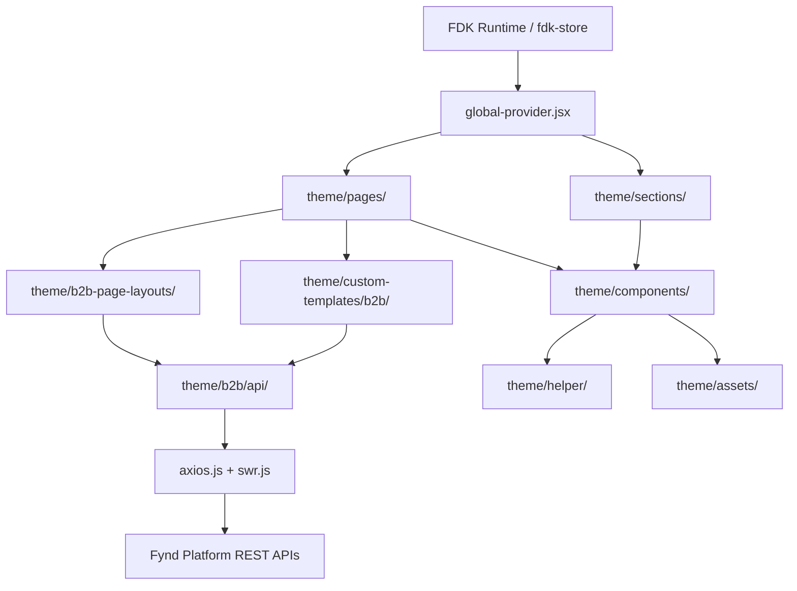

# Architecture

Owner: Frontend Platform Team
Reviewers: Theme Team, QA
Last Updated: 2026-03-14
Last Reviewed: 2026-03-14
Status: Approved

## Overview

Turbo B2B is a Webpack-bundled React 18 application that runs inside the Fynd Commerce FDK runtime. The theme is structured around two primary entry-point types — **pages** and **sections** — plus a rich set of shared components, B2B-specific layouts, and a dedicated B2B API layer.

- [Data Flow](data-flow.md) — how data moves from the FDK store to the UI
- [Module Boundaries](module-boundaries.md) — ownership and dependency rules between directories

## High-level architecture diagram

## Webpack entry points

The build dynamically generates entry points from all `.jsx` files under `theme/pages/` and `theme/sections/`, plus a main theme bundle from `theme/index.jsx`. Section chunking is enabled via `fdk_feature.enable_section_chunking: true` in `package.json`.

## Key runtime data

- **FDK Store** (`fdk-store`, GQL v3.0.67) is the primary data source for product, cart, user, and order state.
- **SWR** (`swr` + `theme/b2b/api/swr.js`) is used for B2B-specific REST data (features flags, distributed dashboard, retail management).
- **Axios** (`theme/b2b/api/axios.js`) handles authenticated B2B REST calls.
