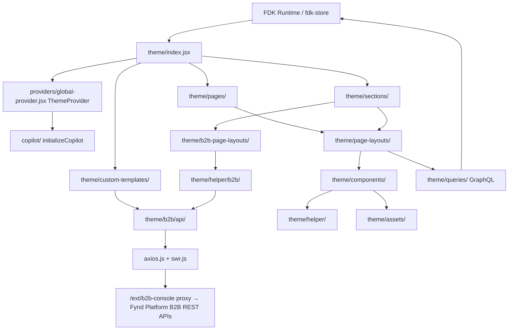

# Architecture

Owner: Frontend Platform Team
Reviewers: Theme Team, QA
Last Updated: 2026-06-11
Last Reviewed: 2026-06-11
Status: Approved

## Overview

Turbo B2B is a Webpack-bundled React 18 application that runs inside the Fynd Commerce FDK runtime. The theme is structured around two primary entry-point types — **pages** and **sections** — backed by **page-layouts** (the actual page implementations), plus a rich set of shared components, B2B-specific layouts (`theme/b2b-page-layouts/`), B2B custom-template routes (`theme/custom-templates/b2b/`), a dedicated B2B REST API layer (`theme/b2b/api/`), a GraphQL query catalogue (`theme/queries/`), and a standalone Copilot integration (`copilot/`).

- [Data Flow](data-flow.md) — how data moves from the FDK store to the UI
- [Module Boundaries](module-boundaries.md) — ownership and dependency rules between directories

## High-level architecture diagram

## Webpack entry points

The build has a single Webpack entry, `themeBundle`, pointing at `theme/index.jsx` (see `webpack.config.js`). Code-splitting happens inside the theme:

- **Pages** are lazy-loaded through dynamic `import()` calls in the page getters exported from `theme/index.jsx` (`getHome`, `getLogin`, `getProductDescription`, …), each with its own webpack chunk name.
- **Sections** are split via `@loadable/component` in `theme/sections/index.js` (one chunk per section). Section chunking is enabled via `fdk_feature.enable_section_chunking: true` in `package.json`.
- **B2B custom-template routes** are split with `React.lazy` in `theme/custom-templates/index.jsx`.

## Key runtime data

- **FDK Store** (`fdk-store`, GQL v3.0.67) is the primary data source for product, cart, user, and order state. GraphQL documents live in `theme/queries/` and are executed via `fpi.executeGQL(...)`; components read state with `useGlobalStore(fpi.getters.X)`. An optional SWR-style cache around FPI calls (`theme/helper/fpi-swr-wrapper.js`) can be enabled via the `enable_swr_caching` theme config.
- **SWR** (`swr` + `theme/b2b/api/swr.js` `SWRProvider`) is used for B2B-specific REST data (feature flags via `useFPIAppConfig`/`useAppConfig`, distributed dashboard, retail management, B2B credit/lender profile).
- **Axios** (`theme/b2b/api/axios.js`, `consoleAxios`) handles authenticated B2B REST calls. Requests go to `<origin>/ext/b2b-console/...` with `withCredentials: true` (cookie auth); base URLs per module (`QUOTATION_BASE_URL`, `BEST_PRICE_BASE_URL`, etc.) are defined in the root `constant.js`.
- **i18n**: per-language string bundles live in `theme/locales/` (`en.json`, `ar.json`, … plus `*.schema.json`) and are consumed through `useGlobalTranslation` from `fdk-core/utils`.
